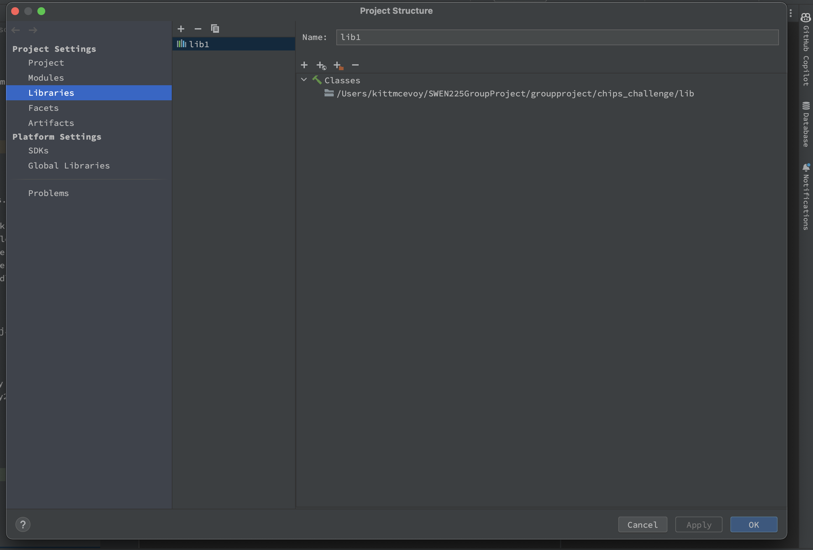
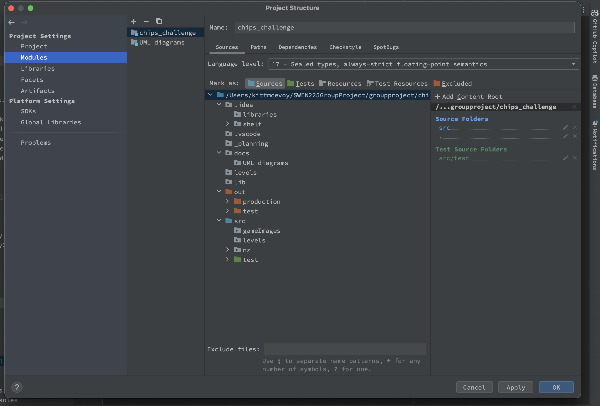

Start the game by running nz.ac.vuw.ecs.swen225.gp22.app.Main from your chosen IDE.

To play the Game select from level 1 choose "Start Game", to Load a game choose "Load game" and to play a recorded game choose "Load recording".

The keys for this game are the up, down, left and right arrow keys.

To keys for Replay of Recorded Game once Recording is loaded:
"-" to decrease Automatic ReplaySpeed, "+" to increase Automatic ReplaySpeed,
"." to replay one single step forward at a time with each press,
"," to replay one single step backwards at a time with each press.

If the game does not compile, please make sure the Project structure for the Modules looks like this:

And the Libraries looks like this:

The Gource video can be found here: https://www.youtube.com/watch?v=_bWZLoOOn_U
